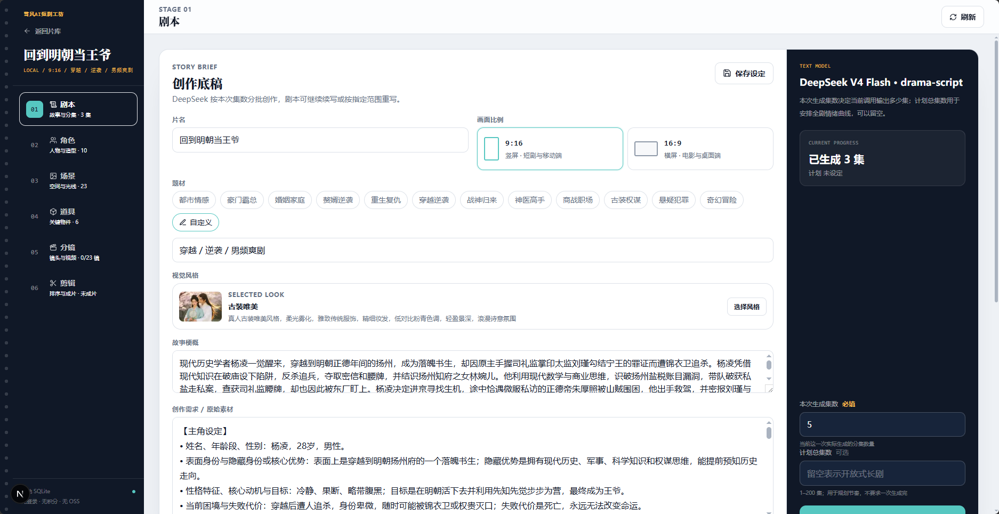
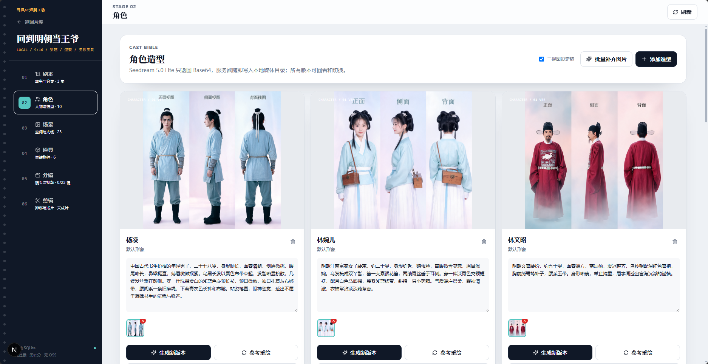
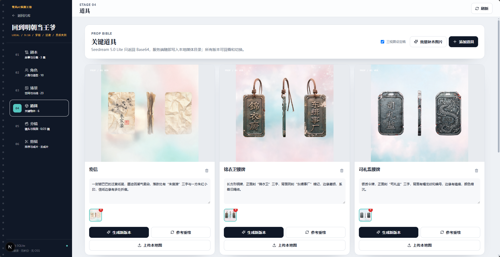
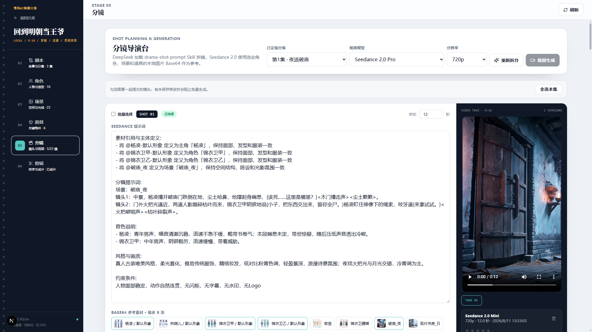

# 雪风AI短剧工坊

<div align="center">

**一个人，一台电脑，把故事变成可以播放的短剧。**

[](https://github.com/oiuv/ai-short-drama/actions/workflows/quality.yml)

开源 · 本地优先 · 剧本到成片 · 素材一致性 · 可逐步控制

[开始本地创作](#快速开始) · [查看完整工作流](#完整创作工作流) · [了解在线正式版](#有彩视界在线正式版实景)

</div>

雪风AI短剧工坊是从 XuefengAI 影视工坊中提炼出来的开源单机版短剧创作工作台。它不是几个互不相干的 AI 生成按钮，而是一条真正串起来的影片生产线：

```text
故事想法 / 原始素材
        ↓
专业分集剧本
        ↓
角色造型 + 空镜场景 + 关键道具
        ↓
一致性参考图
        ↓
AI 分镜 + 逐镜视频
        ↓
分集剪辑 + MP4 成片
```

项目面向希望自己掌握创作流程的个人创作者：无需注册登录，不依赖 OSS，项目数据和生成素材都保存在自己的电脑上。配置模型厂商的 API Key 后，即可使用 DeepSeek、Seedream 和 Seedance 完成创作；部署方式、模型参数和六步工作流都由自己掌握。

## 开源单机版功能预览

下面均为当前开源项目的真实运行界面。六步工作区始终显示剧本、角色、场景、道具、分镜和剪辑进度；点击截图可查看完整大图。

| 创作底稿与分集剧本 | 角色造型与一致性参考图 |
| --- | --- |
| [](docs/images/local-script-workspace.png) | [](docs/images/local-character-bible.png) |
| DeepSeek 加载专业 Skill，把故事想法整理成可续写、可改写、可逐集定稿的爽剧剧本，并同步建立影视素材档案。 | Seedream 为每个角色阶段生成稳定三视图；支持并发补图、本地上传、参考重绘和多版本切换。 |

| 关键道具视觉档案 | Seedance 分镜导演台 |
| --- | --- |
| [](docs/images/local-prop-bible.png) | [](docs/images/local-storyboard-director.png) |
| 为证据、身份信物和剧情转折物件建立可复用档案，让同一道具在连续镜头中保持材质、形状与纹理一致。 | AI 按剧情节拍拆成 4–15 秒视频片段，自动绑定本地 Base64 参考图，并支持逐镜编辑、批量生成和 TAKE 管理。 |

## 为什么值得用

- **流程完整**：从创意、剧本、资产、分镜到剪辑成片都在同一个项目中完成，不必在多个工具之间反复搬运素材。
- **不是裸调模型**：内置标准影视 Skills，把爽点结构、题材模式、连续剧节奏、资产解耦和专业镜头语言固化为可复用的创作方法。
- **一致性优先**：角色造型、场景和关键道具先建立视觉档案，再作为参考图绑定到具体镜头，降低人物变脸、服装漂移和场景跳变。
- **每一步都能改**：剧本可逐集编辑，图片和视频可保留多个版本，分镜提示词、时长和参考素材可单独调整，剪辑入点、出点和顺序可继续修改。
- **本地优先**：SQLite 保存项目状态，图片、视频和成片写入本地目录；备份数据目录即可带走整个工作室。
- **轻量单机部署**：无需用户系统、云存储、消息队列和任务 Worker，一套 Next.js 应用即可运行。

## 完整创作工作流

| 步骤 | AI 帮你完成 | 你可以控制 | 产出 |
| --- | --- | --- | --- |
| **1. 剧本** | 理解创作意图，按批次生成 1–10 集可拍摄剧本，并支持续写和指定分集改写 | 片名、题材、横竖屏、视觉风格、故事素材、本次生成集数、可选计划总集数；逐集编辑与定稿 | 故事梗概、分集剧本、角色/场景/道具档案 |
| **2. 角色** | 提取角色及不同阶段的造型，生成定妆参考图 | 手动增删、修改描述、批量出图、参考重绘、本地图上传、多版本切换 | 可跨镜头复用的角色造型库 |
| **3. 场景** | 提取时段、天气、空间、材质和光线，生成空镜场景图 | 出场集数、描述、批量出图、参考重绘、多版本切换 | 统一的场景与光线档案 |
| **4. 道具** | 识别承担证据、身份、秘密或剧情转折的关键物件 | 类别、描述、出场集数、图片生成与版本管理 | 跨镜头保持外形一致的道具库 |
| **5. 分镜** | 把已定稿单集拆成 4–15 秒的可生成片段，补齐景别、运镜、动作、对白和声音指令 | 逐镜编辑、手动加镜、选择最多 9 张参考图、选择模型/分辨率、多选批量生成 | 可预览、可评分、可备注、可切换版本的本地视频片段 |
| **6. 剪辑** | 按分镜建立分集时间线，并用 FFmpeg 统一编码 | 片段启用、顺序、入点、出点、追加/移除镜头、保存草稿 | H.264/AAC MP4 分集成片 |

## 创作能力详解

### 专业爽剧剧本引擎

输入一句故事想法或人物设定，可以先用 `script-brief` Skill 一键补全为专业爽剧创作需求，再由 DeepSeek 加载 `drama-script` Skill，分批生成分集剧本和影视资产档案。

- 输入再简单也能开始：建立片场时点击“AI 优化需求”，自动补齐主角、对手、故事框架、核心冲突、爽点、关键场景和结局方向，同时保留用户明确的人物、情节与禁忌。
- 预置都市情感、豪门霸总、婚姻家庭、赘婿逆袭、重生复仇、穿越逆袭、战神归来、神医高手、商战职场、古装权谋、悬疑犯罪、奇幻冒险等题材，也支持自定义题材。
- 结合爽点模型、题材模式和爆款结构分析，建立人物欲望、核心阻力、失败代价、认知差、冲突升级、局部高潮和集末钩子。
- “本次生成集数”为必填，单次严格生成指定的 1–10 集；“计划总集数”为可选，用于控制当前批次在整部剧中的节奏位置，超过 10 集时通过续写分批完成。
- 对齐 XuefengAI 爽剧标准：用户未指定时每集默认约 10 场完整戏，复杂多线可扩展到 12–15 场；每集场号从 `[1]` 连续递增，禁止拆分同一场景凑数。
- 已生成第一批剧本后可继续向后续写，也可按指导只改写指定的连续分集；续写保留已有内容，改写不会越过选定范围。
- 输出可直接继续制片的场次格式：地点、时间、人物、可见动作和有效对白清晰分离；相邻场次之间固定保留一个空行，避免场次粘连和无法拍摄的抽象心理描写。
- 自动建立角色、造型、空镜场景和关键道具档案，并标记实际出场集数。
- 每一集都可独立编辑、保存、确认、增删，也可批量定稿或复制全本；定稿后才进入分镜，已有分镜或剪辑时会阻止误取消定稿。

### 角色、场景、道具一致性工作台

短剧最容易翻车的不是“能不能生成一张好图”，而是同一人物、空间和物件能不能在几十个镜头里保持统一。本项目先建立资产档案，再让分镜引用资产：

- **角色造型**：同一角色可维护默认形象、换装、身份阶段或年龄阶段等多个造型。
- **空镜场景**：把地点、时段、天气、陈设、材质、色调和光线固化为可复用的空间参考，画面中不出现人物。
- **关键道具**：只提取真正参与剧情、需要特写或跨镜头保持一致的物件。
- **四种获取方式**：首次生成、批量补齐、基于当前版本参考重绘、上传本地图片。
- **非破坏式版本管理**：每次生成都保留历史版本，可随时切换；删除只会软删除工作区记录，本地素材文件始终保留。
- **全本地保存**：Seedream 返回 Base64 图片后立即写入本地媒体目录，页面不依赖远程 OSS 链接。

### 39 种统一视觉风格

画面风格会贯穿角色、场景、道具、分镜和最终成片。项目完整迁移了 XuefengAI 精选的 39 种风格预设，每种风格都包含实际用于生成的色彩、材质、光影和构图描述，而不只是一个标签。

| 类型 | 风格示例 |
| --- | --- |
| **真人影视** | 电影质感、韩剧、日剧、古装唯美、古装权谋、武侠江湖、悬疑冷调、港风复古、赛博朋克、战争史诗、经典黑白、恐怖电影 |
| **2D 动画** | 国漫二次元、日系手绘、上美画风、水墨、像素、暗黑漫画、黑白漫画、电影厚涂、热血漫、皮影剪纸 |
| **3D 动画** | 3D 国风、美式 3D、粘土动画、定格动画、高端写实 3D、动漫三渲二、微缩景观、盲盒潮玩、暗黑奇幻 |

同时支持 `9:16` 竖屏短剧和 `16:9` 横屏影片；比例会自动贯穿图片尺寸、视频参数和最终导出。

### Seedance 2.0 分镜导演

`drama-shot-prompt` Skill 不只是把剧本机械切段，而是把文字翻译成可以交给视频模型执行的镜头：

- 保持原剧情顺序、人物关系、关键事件和对白含义，不擅自改写故事。
- 把抽象情绪转成表情、视线、动作、空间关系、环境反应和可见细节。
- 为每个片段组织主体、动作、景别、机位、运镜、光影、对白、环境音和 BGM 指令。
- 根据表演内容估算 4–15 秒时长，长动作会按戏剧节拍合理拆镜。
- 自动关联本集可用资产；Skill 用 `@角色-形象`、`@场景`、`@道具` 在“素材引用与主体定义”中精确绑定，每个镜头最多选择 9 张参考图。
- 提交 Seedance 前，本地解析器把 `@` 标签按 Base64 图片输入顺序确定性转换为 `图片1、图片2……`，确保提示词编号与人物、空间和物件一一对应。
- 支持 Seedance 2.0、Fast、Mini，支持 480p、720p、1080p、4K（具体取决于模型）。
- 可逐镜生成，也可勾选指定镜头按受控并发批量提交；未保存的镜头修改不会被批处理覆盖。
- 每个镜头可生成多个 TAKE；每版保留模型、分辨率、时长、创建时间和提示词快照，并可评分、备注、删除或选择进入剪辑。
- 视频完成后立即下载到本机，避免临时结果链接过期。

### 本机分集剪辑与导出

生成视频不是终点。剪辑台会把已选中的镜头版本加入分集时间线：

- 一键按分镜顺序建立时间线，也可追加、移除和重新排序片段。
- 独立控制每段视频是否启用，以及精确设置入点和出点。
- 剪辑草稿持续保存在 SQLite 中，离开页面后可以继续。
- 调用本机 FFmpeg 统一画幅、30fps 和编码，导出 H.264/AAC MP4。
- 成片保存在 `data/media/exports/`，可直接在页面预览和下载。

## 开源单机版的意义

这个项目有两个明确目标：

1. **让个人真正拥有一套短剧创作工具。** 源码开放，数据在本机，API Key 自己管理；部署、模型配置和创作流程都清晰可控，适合希望自主搭建工作台的个人创作者和开发者。
2. **展示雪风AI的专业影视创作能力。** 开源版跑通最核心的爽剧生产线；有彩视界则提供免部署的即开即用体验，以及专业小说改编、通用剧本、音频创作、多模型工具、云端素材库和有彩画布等更完整的创作能力。

需要说明的是，“本地部署”指应用和数据运行在本机；DeepSeek、Seedream、Seedance 仍是联网 API，会产生模型供应商费用，并非离线模型。

## 开源版与有彩视界

| | 开源单机版（本项目） | [有彩视界在线版](https://youcai.art) |
| --- | --- | --- |
| **适合谁** | 喜欢自己部署、希望数据落本机的个人创作者和开发者 | 希望免部署使用完整平台的创作者、团队和专业用户 |
| **核心流程** | 爽剧剧本 → 角色/场景/道具 → 分镜 → Seedance 视频 → 本机成片 | 更完整的影视工坊与在线创作工作流 |
| **剧本能力** | 内置专业爽剧创作 Skill | 爽剧、通用剧本、专业小说改编、剧本上传与继续创作 |
| **模型与工具** | DeepSeek + Seedream + Seedance，聚焦最短可用链路 | 汇集多家主流模型与 50+ 文本、图片、音频、视频工具 |
| **素材管理** | 项目级本地素材和版本管理 | 云端个人素材库、跨工具复用与灵感广场 |
| **声音能力** | 视频模型内声音指令；剪辑器暂不提供独立配音/音乐轨 | 语音合成、音色设计/复刻、音乐创作等完整音频工具 |
| **高级创作** | 单机六步工作台 | 影视工坊、有彩画布、节点化跨模态创作 |
| **部署维护** | 自己配置 Node.js、FFmpeg 和 API Key | 打开网页即可使用 |

**想先掌握完整流程，就从开源版开始；想把更多精力留给创作，直接使用 [有彩视界](https://youcai.art)。**

## 有彩视界在线正式版实景

本开源项目把有彩视界影视工坊最核心的短剧生产线精简为可在个人电脑部署的六步工作台；在线正式版则提供完整的平台导航、创作入口、云端项目管理和更丰富的专业工作流。以下截图来自同源的 XuefengAI 正式项目实际运行界面，并非当前开源仓库的页面。

### 影视工坊与项目中心

[](https://youcai.art)

在线版把爽剧、短剧、正剧和剧本上传等创作入口集中在影视工坊中，并通过项目卡片统一呈现集数、角色、场景和六步制作进度，适合持续管理多部作品。

### 分集剧本专业工作台

[](https://youcai.art)

分集剧本工作台支持长篇项目管理、逐集编辑与定稿、AI 编辑、同步原始剧本和批量操作；角色、场景、道具、分镜与剪辑进度始终在同一工作区内可见。

### 分镜视频创作

[](https://youcai.art)

在线分镜工作台把角色、场景和声音素材直接带入单个镜头，支持素材引用、专业提示词编辑、模型与分辨率选择、镜头时长控制、结果预览和重新生成。创作者既能让 AI 完成镜头设计，也能逐项控制最终效果。

### 多轨剪辑与成片导出

[](https://youcai.art)

在线剪辑台统一调用项目中的视频、音频、图片和上传素材，在可视化时间线上完成分集编排、预览和输出设置，并直接导出 MP4，把“生成素材”真正推进到“交付成片”。

> 想免部署即开即用，或需要专业小说改编、通用剧本、剧本上传续作、配音音乐、多模型选择、个人素材库和无限画布？点击截图或直接访问 [有彩视界](https://youcai.art)。

## 快速开始

### 环境要求

- Node.js 20.9 或更高版本
- npm
- DeepSeek API Key
- 火山方舟 API Key，并已开通 Seedream 5.0 Lite 与所选 Seedance 2.0 模型
- FFmpeg（仅剪辑导出成片时需要），终端中应能运行 `ffmpeg -version`

### 1. 安装并启动

Windows：

```powershell
npm install
copy .env.example .env.local
npm run db:init
npm run dev
```

macOS / Linux：

```bash
npm install
cp .env.example .env.local
npm run db:init
npm run dev
```

### 2. 配置模型

编辑 `.env.local`：

```dotenv
DEEPSEEK_API_KEY=your_deepseek_key
DEEPSEEK_BASE_URL=https://api.deepseek.com
DEEPSEEK_MODEL=deepseek-v4-flash

VOLCENGINE_API_KEY=your_volcengine_key
SEEDREAM_MODEL=doubao-seedream-5-0-260128
SEEDANCE_MODEL=doubao-seedance-2-0-260128
```

### 3. 开始创作

打开 <http://localhost:3000>，建立第一个片场：

1. 填写故事想法或粘贴原始素材；
2. 选择题材、视觉风格和横竖屏；
3. 填写本次生成集数，并按需填写计划总集数，生成或续写剧本与素材档案；
4. 为角色、场景和道具生成或上传参考图；
5. AI 拆分分镜并批量生成视频；
6. 在剪辑台裁切排序，导出本集 MP4。

### 4. 调试 DeepSeek 调用

这是本机项目，页面请求会直接在浏览器开发者工具的 Console 中输出开始时间、接口、HTTP 状态和耗时。DeepSeek 调用失败时还会输出一组安全诊断元数据，包括：

- `diagnosticId`：本次故障编号，可与运行 `npm run dev` 的终端日志对应；
- `phase`：失败发生在网络、HTTP、流解析、空内容、JSON 解析或结构校验中的哪一阶段；
- `finishReason`、`contentLength`、`reasoningContentLength`、`streamChunkCount`：用于区分真空响应、只返回推理、输出截断和流中断；
- `providerRequestId`：模型厂商返回请求号时用于进一步排查。

服务端终端会额外显示截断后的错误响应摘要。两端日志都不会记录 API Key、请求正文、Base64 或完整剧本。当前项目直接调用 DeepSeek V4 Flash，使用该模型的 `384000` 最大输出、JSON 思考模式和流式接收；模型参数以当前项目实际使用的 Provider 和模型为准，不能照搬 XuefengAI 中其他 Provider 或模型部署的数值。

`npm run db:init` 可以省略，服务首次访问数据库时会自动初始化。

更新代码后如果版本包含数据库结构变更，请先停止应用、备份数据目录，然后显式执行迁移再重新启动：

```bash
npm run db:migrate
```

应用启动和 `db:init` 不会自动迁移旧数据库。迁移脚本位于 `scripts/migrations/`，使用 `YYYYMMDDHHmmss-description.ts` 时间戳前缀，按顺序执行并记录结果；同一命令可以安全重复运行。

生产运行：

```bash
npm run build
npm start
```

## 数据完全掌握在自己手中

默认数据目录：

```text
data/
├── studio.db
├── media/
│   ├── images/
│   ├── uploads/
│   ├── videos/
│   └── exports/
└── tmp/
```

可通过 `DATA_DIR` 把数据放到其他磁盘：

```dotenv
DATA_DIR=D:\ai-short-drama-data
```

备份整个数据目录即可保存项目、素材版本、分镜状态、剪辑草稿和导出成片。`data/` 与 `.env*` 默认不会提交到 Git。

本项目不在运行时代码中维护旧 Schema 兼容逻辑。能够安全保留数据的升级通过显式、可重复且非破坏性的迁移脚本完成；无法安全迁移时，版本说明会要求先备份或重命名原数据目录，再使用空的 `DATA_DIR` 启动。

## 技术架构

- **应用**：Next.js 16、React 19、TypeScript、Tailwind CSS
- **本地数据库**：SQLite + `better-sqlite3`
- **文本创作**：DeepSeek + 标准影视 Skills
- **图片生成**：火山方舟 Seedream 5.0 Lite，Base64 结果本地持久化
- **视频生成**：火山方舟 Seedance 2.0 / Fast / Mini
- **剪辑导出**：本机 FFmpeg
- **媒体访问**：受控本地媒体路由，包含路径编码和目录穿越防护

项目不依赖 OSS。上传图片和模型参考图使用 Base64 data URL；Seedance 临时视频 URL 只用于服务端即时下载，页面后续只访问本地媒体。

## 可复用的标准影视 Skills

专业创作方法没有散落、硬编码在 API 中，而是保存在 `skills/`，既供应用自动加载，也可被其他支持标准 Skill 的工具复用：

```text
skills/
├── script-brief/
│   ├── SKILL.md
│   └── agents/openai.yaml
├── drama-script/
│   ├── SKILL.md
│   ├── agents/openai.yaml
│   └── references/
│       ├── satisfaction-model.md
│       ├── theme-patterns.md
│       └── template-analysis.md
├── drama-shot-prompt/
│   ├── SKILL.md
│   └── agents/openai.yaml
├── sd2-pe/
│   └── SKILL.md
└── sd25-pe/
    └── SKILL.md
```

- `script-brief`：把一句话或零散故事设定补全为结构化、可编辑的专业爽剧创作需求。
- `drama-script`：从创作意图到分集剧本，同时建立角色、场景和道具资产档案。
- `drama-shot-prompt`：把单集剧本变成适合 Seedance 2.0 的 4–15 秒专业视频片段。
- `sd2-pe`：保留的 Seedance 2.0 官方提示词优化 Skill，可用于后续增加分镜脚本优化能力；当前六步流程不会自动改写已经生成的分镜。
- `sd25-pe`：保留的 Seedance 2.5 官方提示词优化 Skill，覆盖多参考、关键帧、故事板、白模、视频/声音编辑与延长；作为未来模型升级备用，当前流程不会自动加载，也不会改变现有 Seedance 2.0 模型配置。

单机版把素材整理并入剧本创作：`drama-script` 每次生成、续写或改写剧本时，同时输出本次分集实际出现的角色造型、空镜场景和关键道具，应用自动合并入本地素材档案。项目不设置单独的素材提取步骤，也不运行独立的素材提取 Skill。

Skill frontmatter 只使用标准字段 `name` 和 `description`；模型、Token、响应格式和应用权限由应用层负责，不把运行环境绑死在 Skill 内。

### 与有彩视界同名 Skill 的能力差异

本项目不是用普通提示词替代线上能力，而是把有彩视界中与爽剧六步生产线直接相关的专业规则收敛为单机契约。`drama-script` 仍包含爽点模型、题材模板、连续剧节奏、精确集数、分批续写、指定分集改写、可拍摄正文和角色/空镜场景/道具解耦；`drama-shot-prompt` 仍负责剧情完整覆盖、4–15 秒拆镜、画幅构图、参考图绑定、文字音色和工程镜头语言。差异主要来自产品边界，而不是把本地版降级为演示 Prompt。

| 同名 Skill | 开源单机版（本项目） | [有彩视界在线版](https://youcai.art) |
| --- | --- | --- |
| `script-brief` | 聚焦爽剧，把零散创意整理成可直接开写的结构化需求 | 同时服务爽剧与通用短剧，并可衔接不同专业编剧入口 |
| `drama-script` | 保留核心爽点知识、连续剧控制、续写/改写和影视资产同步建档 | 规则与质量检查更细，并与云端长篇创作记录、通用剧本、专业小说改编和上传剧本工作流协同 |
| `drama-shot-prompt` | 使用角色、场景、道具本地图片和文字音色，产出可直接生成的 Seedance 2.0 分镜 | 进一步支持音色样本、外部音视频参考、更完整的素材组合及导演镜头范式 |
| `sd2-pe` / `sd25-pe` | 保留与 XuefengAI 同名版本一致的 Prompt 优化正文，当前作为备用 Skill | 可在更完整的多模态工具、素材库和模型工作流中调用 |

因此，本地版适合个人完整跑通高质量爽剧生产线；需要更多剧本类型、长篇素材管理、音频参考、多模型协作与专业在线生产工具时，有彩视界提供更完整的工作环境。

## 模型与参数

| 用途 | 默认模型 | 可配置项 |
| --- | --- | --- |
| 需求优化、剧本、素材档案、分镜拆解 | `deepseek-v4-flash` | `DEEPSEEK_MODEL` |
| 角色、场景、道具图片 | `doubao-seedream-5-0-260128` | `SEEDREAM_MODEL` |
| 分镜视频 | `doubao-seedance-2-0-260128` | `SEEDANCE_MODEL`，界面也可选择 Fast / Mini |

Seedance 片段时长限制为 4–15 秒。标准版支持 480p、720p、1080p、4K；Fast 和 Mini 支持 480p、720p。实际可用模型、额度、价格和区域权限以模型供应商账户为准。

## 开发与验证

```bash
npm run typecheck
npm run lint
npm test
npm run build
```

自动化测试覆盖模型 ID 与调用参数、DeepSeek 流式响应和安全诊断、画幅、时长约束、Base64 data URL 解析、本地媒体 URL 编码、Skill 加载和目录穿越防护。真实模型调用需要有效密钥且会产生费用，因此不包含在离线测试中。

测试范围遵循“本地数据安全优先、默认无网络、不过度建设”的原则，详见[本地版自动化测试规范](./docs/dev/testing-strategy.md)。

<details>
<summary><strong>当前版本边界与安全说明</strong></summary>

- 开源单机版当前聚焦爽剧创作，支持爽剧分批生成、续写和指定分集改写；没有迁移专业小说改编、通用短剧或上传个人剧本后的格式化创作流程，这些能力请使用 [有彩视界](https://youcai.art)。
- 这是个人单机工具，不提供多人协作、远程账户、权限隔离或公共云部署方案。项目没有登录与访问控制，请勿直接暴露到公网。
- 角色声音只保留文字音色描述，并随角色素材交给分镜 Skill 组织 Seedance 声音指令；单机版不提供音频样本、音色复刻或音频参考绑定。
- 剪辑与成片固定使用本机 FFmpeg，聚焦镜头选择、排序、裁切和分集拼接；不迁移 WebGPU 编辑器，也不包含独立的多轨字幕、配音、音乐、转场和专业调色。
- 视频任务在分镜页自动轮询；应用重启后可根据 SQLite 中保存的任务 ID 继续查询。
- 图片和视频版本采用软删除，默认读取不会显示已删除版本；项目、剧本、素材描述、分镜和剪辑草稿只保存当前状态，不维护文本历史版本。本地图片、视频和已导出文件不会随删除或重新生成而移除。

</details>

## 参与项目

欢迎提交 Issue、改进文档、补充测试或贡献代码。也欢迎分享你用雪风AI短剧工坊创作的作品，让更多个人创作者看到开源 AI 影视生产的可能性。

## License

MIT

---

**雪风AI短剧工坊**：让每个人都能在自己的电脑上创作短剧。

**[有彩视界](https://youcai.art)**：让创作更快、更完整、更专业。
